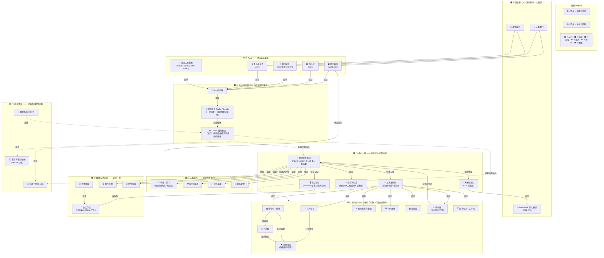

# DeepSeek Harness 架构总览

> 面向非程序员的分层架构图。每一层是一个"区域"，箭头表示"谁调用谁 / 谁依赖谁"。

## 一分钟读懂这张图

1. **入口（①）**：人类通过网页界面或命令行进来，其他程序通过 SDK/ACP 进来——入口只是"门"，不重要。
2. **启动组装（②）**：`dsh` 启动器按一份"插件清单"(Profile/Bundle) 把需要的零件拼起来。这套框架叫 **Cordis**，它的设计哲学是"**一切都是插件**"——连大脑本身也是插件，随时可换。
3. **核心大脑（③）**：真正的循环是"**想→动手→看结果**"（Agent Loop）。它一边读聊天记忆、一边向大模型提问，然后把模型想做的动作交给"工具注册表"。
4. **能力层（④）**：代理的"手和眼"——文件、命令行、联网、代码理解、技能库、子代理、沙箱。**这些能力都可以整体替换**，这正是插件架构的威力。
5. **人机协作（⑤）**：当代理想执行有风险的操作时，会停下来问你、展示计划，而不是擅自行动。
6. **数据（⑥）**：所有对话记录都存成文件（JSONL/SQLite），可以检索、续聊。
7. **地基（⑦）**：公共工具库、类型系统、第三方框架依赖，是上面所有层的共同地基。
